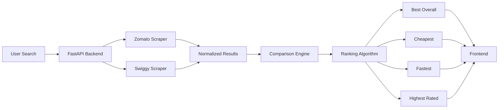

<div align="center">

# 🍽️ FlavourFind

### Search Once. Compare Everywhere. Order Smarter.

<p>


</p>

### 🚀 Compare food across multiple delivery platforms in real-time and discover the best option based on price, ratings, delivery time and offers.

</div>

---

# 📌 Overview

FlavourFind is a real-time food comparison engine that searches multiple food delivery platforms simultaneously and recommends the best options.

Instead of opening multiple apps to compare prices, delivery times and ratings, FlavourFind performs the comparison automatically.

Search naturally like:

```text
Best pizza under ₹400

Healthy meal under ₹250

Biryani for 3 people under ₹700

Fastest burger delivery near me
```

---

# ⚡ How It Works



---

# ✨ Features

- 🔍 Natural language food search
- ⚡ Real-time restaurant comparison
- 🍕 Multi-platform search
- 📊 Intelligent ranking engine
- 💰 Cheapest option detection
- ⭐ Highest-rated recommendations
- 🚀 Fastest delivery recommendations
- 🎯 Smart comparison of offers across platforms
- 📱 Modern responsive UI

---

# 🧠 Ranking Engine

Every restaurant is evaluated using multiple factors instead of relying on a single metric.

Current ranking considers:

- ⭐ Ratings
- 💰 Pricing
- 🚚 Delivery Time
- 🎁 Discounts & Offers

The recommendation engine generates:

- Best Overall
- Cheapest
- Fastest
- Highest Rated

---

# 🏗 Tech Stack

## Frontend

- React
- Vite
- Tailwind CSS
- Framer Motion

## Backend

- FastAPI
- Python 3.11
- Pydantic

## Scraping

- Playwright
- Internal API Interception
- DOM Fallback Extraction

---

# 📂 Project Structure

```text
server/
│
├── routes/
├── schemas/
├── services/
├── scrapers/
│     ├── zomato/
│     └── swiggy/
│
├── main.py
└── requirements.txt

client/

├── src/
├── pages/
├── components/
└── services/
```

---

# 🚀 Current Development Progress

## Core Platform

- [x] React Frontend
- [x] FastAPI Backend
- [x] Search API
- [x] Ranking Engine

## Zomato

- [x] Playwright Setup
- [x] Restaurant Extraction
- [x] API Interception
- [x] Real-time Search

## Swiggy

- [x] Playwright Setup
- [x] Restaurant Extraction
- [x] Comparison Integration

## Comparison Engine

- [x] Unified Search
- [x] Result Normalization
- [x] Platform Comparison
- [x] Ranking

## Upcoming

- [ ] Location-based Search
- [ ] Restaurant Images
- [ ] Better ETA Prediction
- [ ] AI-powered Recommendations
- [ ] Historical Price Tracking

---

# 🎯 Example Searches

```text
Best pizza under ₹500
```

```text
Cheapest burger near me
```

```text
Healthy meals under ₹250
```

```text
Highest rated biryani
```

```text
Fastest momos delivery
```

---

# 🌍 Vision

FlavourFind aims to become the **search engine for food delivery**.

Instead of asking:

> "Should I order from Zomato or Swiggy?"

Users simply search once.

FlavourFind compares everything and recommends the best option.

---

# 🤝 Contributing

Contributions, ideas and feature requests are always welcome.

Feel free to open an issue or submit a pull request.

---

<div align="center">

## Built with ❤️ by **Rhythem Sabharwal**

⭐ If you like the project, consider giving it a star!

</div>