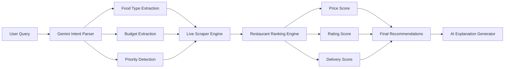

<div align="center">


# 🍕 FoodLens AI

### One Search. Every Platform. The Best Deal.

<p>
  
  
  
</p>

<p>
  <strong>
  Find the cheapest, fastest, and highest-rated food across delivery platforms using natural language.
  </strong>
</p>

<br>

</div>

---

## 🤔 Why FoodLens?

Every food delivery app shows different prices.

You open:

✅ Zomato
✅ Swiggy
✅ MagicPin

...and spend 10 minutes comparing offers.

FoodLens AI does this automatically.

Simply type:

```text
Cheap paneer momos under ₹150
```

or

```text
Pizza for 4 people under ₹800
```

or

```text
Best biryani with fastest delivery
```

and FoodLens finds the best options instantly.

---

# ⚡ How It Works



---

# ✨ Core Features

| Feature                    | Description                                     |
| -------------------------- | ----------------------------------------------- |
| 🧠 Natural Language Search | Search like chatting with a friend              |
| 🎯 AI Intent Parsing       | Understands food, budget, people count          |
| ⚡ Live Price Fetching      | Real-time platform data                         |
| 🏆 Smart Ranking           | Best value first                                |
| 💬 AI Explanations         | Explains every recommendation                   |
| 🔍 Food Relevance Engine   | Pizza results won't appear for biryani searches |

---

# 🎮 Try Example Queries

```text
Cheap burger under ₹120
```

```text
Best pizza for 2 people under ₹500
```

```text
Healthy meal under ₹250
```

```text
Fastest delivery biryani near me
```

```text
Highest rated momos under ₹200
```


---

# 🚀 Development Progress

## Phase 1 — AI Understanding

* [x] Natural Language Parsing
* [x] Gemini Integration
* [x] Query Normalization

## Phase 2 — Live Search

* [x] Playwright Setup
* [x] Zomato Data Extraction
* [x] API Interception

## Phase 3 — Ranking Engine

* [x] Relevance Scoring
* [x] Utility Scoring
* [x] Recommendation Explanations

## Phase 4 — Multi Platform

* [ ] Swiggy Integration
* [ ] MagicPin Integration
* [ ] EatFit Integration

## Phase 5 — User Experience

* [ ] Location Detection
* [ ] Saved Preferences
* [ ] User Profiles

## Phase 6 — Scale

* [ ] Docker Deployment
* [ ] Redis Queue
* [ ] Background Workers
* [ ] Cloud Hosting

---

# 🛠 Tech Stack

### Frontend

* React
* Vite
* Framer Motion
* CSS

### Backend

* FastAPI
* Python 3.11

### AI

* Gemini 2.5 Flash

### Scraping

* Playwright

---

# 🔥 Current Architecture

```text
React Frontend
       │
       ▼
FastAPI Backend
       │
       ▼
Gemini Intent Parser
       │
       ▼
Playwright Scraper
       │
       ▼
Ranking Engine
       │
       ▼
AI Recommendations
```

---

# 🌟 Vision

FoodLens AI aims to become:

"The Google Search for Food Delivery."

Search once.

Compare everywhere.

Order smarter.

---

<div align="center">

### Built by Rhythem Sabharwal 🚀

⭐ Star the repository if you like the idea.

</div>
